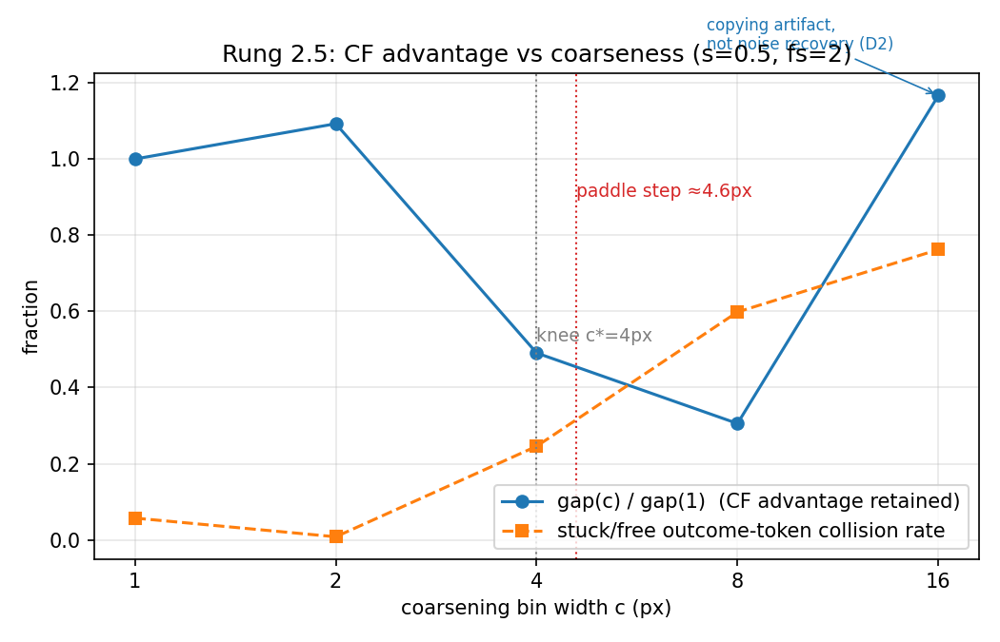

# CausalJEPA — Rung 2.5: the coarsening sweep (Problem B probe)

Rung 2 established that Gumbel-Max abduction beats no-abduction intervention under ALE's
own sticky-action noise (`error_CF < error_IV` at every `s > 0`). Rung 2.5 asks the next
question: **at what representational abstraction does that advantage die, and why?** We
re-run the exact Rung 2 pipeline with the model's world — the state it conditions on AND
the delta-token vocabulary it predicts over — quantized to bin width `c ∈ {1,2,4,8,16}`
px, simulating a lossy tokenizer **without training one**. The oracle and all eval
targets stay full-fidelity; errors are in physical px; ONE fixed set of 250 eval tuples
is reused identically at every level; one fresh model per level, same hyperparameters.

## Locked settings

- `s = 0.5` — read off the Rung 2 results: the clearest gap (0.432, with 128/250 stuck
  steps, vs 0.196 @ s=0.25 and 0.152 @ s=0.1). Not ambiguous, so the skill's 0.25
  fallback was not needed.
- fs=2, OCAtari Pong, history(N=8), same collection seeds/params as Rung 2's s=0.5 run.
- `c=1` is bit-identical to Rung 2 (identity coarsening + Rung 2's delta widths) and is
  the anchor; `c≥2` floors states to the c-lattice and decodes to bin centers, with
  delta-bins refit per level (asserted lossless on the training deltas).

## Run

```
python -m pong_counterfactual.cjepa_rung25.sweep              # primary (history ON)
python -m pong_counterfactual.cjepa_rung25.sweep --no-history # secondary axis
python -m pong_counterfactual.cjepa_rung25.analyze            # table, knee, plot, spec
```

(use the repo `.venv`: `.venv\Scripts\python.exe -m ...`; the seed-replay oracle results
are cached in `oracle_cache_s0.5.npz` after the first run)

## Acceptance checks

- **A. Anchor — PASSED, exactly.** c=1 reproduces the stored Rung 2 s=0.5 row to the
  digit: CF 1.980 / IV 2.412 / gap 0.432 / stuck-gap 0.641 (the eval rng schedule was
  replicated, so the match is deterministic, not just "within seed noise").
- **B. Oracle gates — inherited from Rung 2** (env-side, coarseness-independent, run
  once there): seed-replay determinism 100%, action-independence 100%, fire rate tracks
  s, at every s including 0.5. Model no-op CF = observed token and oracle no-op = factual
  remain 100% at **every coarsening level** here.
- **C. Collapse curve — below.** Knee found; the curve is non-monotone at c=16, which
  was investigated (D2/D3) and is fully explained, not noise.
- **D. Mechanism — collision licensed.** corr(collision rate, noise-recovery gap) =
  **−0.976**.
- **E. Training sanity — OK.** At the collapsed levels (c=4: 46.5%, c=8: 56.5%) held-out
  player_y top-1 is at or above the c=1 level (45.8%); coarser is easier, as expected.
  The collapse is not a training artifact.

## The collapse table (paddle L1 in px vs the full-fidelity oracle CF; n=250 paired tuples)

| c (px) | error_CF | error_IV | gap | gap/gap(1) | collision (free) | error_COPY | CF==obs |
|---|---|---|---|---|---|---|---|
| 1 | 1.980 | 2.412 | 0.432 | 1.00 | 5.7% | 2.992 | 38% |
| 2 | 1.986 | 2.458 | 0.472 | 1.09 | 0.8% | 2.978 | 38% |
| **4** | 2.906 | 3.118 | **0.212** | **0.49** | 24.6% | 3.290 | 56% |
| 8 | 4.022 | 4.154 | 0.132 | 0.31 | 59.8% | 3.878 | 75% |
| 16 | 5.142 | 5.646 | 0.504* | 1.17* | 76.2% | 4.866 | 88% |

**The knee is `c* = 4 px` — almost exactly the action-induced signal size**: the
free-step paddle delta at fs=2 is **4.59 px**. Once the bin width swallows the paddle's
per-step move, stuck and free transitions land in the same token (collision 0.8% → 24.6%
→ 59.8% → 76.2%) and the observed outcome stops carrying noise information. This is the
predicted Problem B mechanism, observed quantitatively.

\* the c=16 rebound is **not** a recovery of the counterfactual advantage — see below.



## The c=16 rebound: counterfactual stability degenerates into factual-copying

The raw IV−CF gap is non-monotone (0.43 → 0.47 → 0.21 → 0.13 → 0.50). The skill demands
investigation before reporting, and the investigation cleanly decomposes the gap into
**two different advantages**, only one of which is abduction:

1. **Noise recovery** (the real thing): the observed token tells the model whether the
   sticky fired; abduction pins that and transfers it to the intervened action. Measured
   on the tuples whose token still distinguishes the two noise branches (non-collided),
   this gap **collapses monotonically and then inverts**: +0.23 → +0.22 → −1.05 → −2.33
   → −4.41. corr(collision, noise-recovery gap) = **−0.976** — the collision curve tracks
   exactly what abduction loses.
2. **Factual-copying** (the Gumbel stability prior): when the observed token carries no
   information, abduction's posterior just makes the CF repeat the observed token
   (CF==obs rises 38% → 88%). At s=0.5 over half the eval steps are stuck, and on a stuck
   step the true CF *equals* the factual — so copying is trivially right there, while IV
   re-rolls and sometimes predicts a ±16 px move. That, not noise recovery, is the whole
   c=16 "gap": a model-free copy-the-observed-token baseline (error_COPY 4.87) already
   **beats** the abducted CF (5.14) at c=16, whereas at c=1 abduction beats copying by a
   full px (1.98 vs 2.99).

So past the knee the counterfactual machinery doesn't degrade gracefully into an
intervention — it degenerates into "predict that nothing changed", which *looks* good in
average error on a sticky-heavy eval but is **actively harmful on the very steps that
still carry signal** (noise-recovery gap −4.41 at c=16).

## Secondary axis: history does NOT rescue coarsening

| c | gap (history ON, N=8) | gap (history OFF, N=1) |
|---|---|---|
| 1 | 0.432 | 0.356 |
| 2 | 0.472 | 0.508 |
| 4 | 0.212 | 0.284 |
| 8 | 0.132 | 0.084 |
| 16 | 0.504* | 0.668* |

History helps at full fidelity (Rung 1.1's feedable-latent effect) but does not preserve
the gap through the knee — both variants collapse at c≥4 and both show the same
copying artifact at c=16 (larger with history OFF, i.e. *more* degenerate). Coarsening
destroys information in the **outcome token**, which no amount of input history can
restore: abduction needs to *read* the noise out of the observed next-state, and past the
knee there is nothing left to read.

## RUNG 3 SPEC (the deliverable)

Gumbel-Max abduction retains ≥50% of its counterfactual advantage only while the
representation resolves paddle/ball deltas finer than **c\* = 4 px** — i.e. finer than
the action-induced per-step paddle delta (~4.6 px at fs=2). A Rung 3 tokenizer must
preserve at least this resolution — and the stuck-vs-non-stuck **outcome distinction**
in particular (outcome-token collision was 25% at the knee and 76% at c=16) — or
counterfactuals will degenerate to interventions. Moreover, the failure mode is worse
than graceful: past the knee the Gumbel stability prior makes the "counterfactual" copy
the factual outcome (CF==obs 88% at c=16; a model-free copy baseline beats it), which
inflates average-error metrics on sticky-heavy data while being actively wrong on every
step whose outcome still carries noise information. Rung 3 evaluation must therefore
include the collision rate and the copy baseline as standing diagnostics, not just the
raw CF-vs-IV gap. History input does not compensate for outcome-token coarseness.

## Files

- `coarsen.py` — the coarsening operator (floor to bin, decode to bin center; c=1 =
  identity), per-level delta-bin refit (asserted lossless), coarse history features.
- `sweep.py` — the driver: ONE full-fidelity collection (Rung 2's exact seeds), cached
  seed-replay oracle pass (CF target, no-op validity, stuck label, other-branch state for
  the collision probe), then per level: refit bins → train fresh HistModel → run the 250
  fixed tuples. `--no-history` = secondary axis.
- `analyze.py` — collapse table, knee, mechanism checks (collision, copy baseline,
  collision-split gap), the plot, and the spec paragraph.
- `results_rung25.json`, `results_rung25_nohist.json`, `oracle_cache_s0.5.npz`,
  `rung25_collapse.png` — outputs.

## Out of scope (later rungs)

No pixels, no learned encoder, no VQ/codebook (Rung 3); no RL (Rung 4); no multi-step
rollouts (Rung 1.5).
